# 📦 Supply Chain & Inventory Analytics

End-to-end Data Analytics project that transforms inventory, purchase order, and demand data into actionable logistics insights using **SQL**, **Python**, and **Power BI**.

---

## 📌 Project Overview

This project analyzes 120 SKUs across multi-warehouse locations (Riyadh, Jeddah, Dammam), 400 purchase orders, and monthly demand to answer key business questions related to stock health, stock-outs, inventory value, supplier performance, lead times, and reorder priority.

The complete pipeline follows a real-world data analyst workflow:

**SQL → Python (Pandas + Matplotlib) → Power BI Dashboard**

Framed for **e-commerce / retail logistics** operations supporting multi-city inventory and supplier decisions.

---

## 🛠️ Tools & Technologies

- **SQL (MySQL)** – Data extraction and supply chain analysis
- **Python** – Data cleaning, exploratory data analysis (EDA), and visualization
- **Pandas & NumPy** – Data manipulation
- **Matplotlib & Seaborn** – Charts and visual insights
- **Power BI** – Interactive Supply Chain Dashboard
- **Git & GitHub** – Version control and project showcase

---

## ✨ Key Features

- Overall KPIs (Total SKUs, Inventory Value, Stock-out Rate, On-Time %)
- Stock status breakdown (Healthy / Low Stock / Stock-out)
- Inventory value by category and warehouse
- Supplier on-time delivery and average lead time
- Fill rate and order value by supplier
- Reorder / at-risk product list
- Interactive Power BI Dashboard with actionable recommendations

---

## 📈 Key Insights

- A meaningful share of SKUs are stock-out or below reorder point
- Inventory value concentrates in specific categories and warehouses
- Supplier on-time performance and lead times vary clearly across partners
- Reorder priority should focus on stock-outs with ongoing demand
- Balancing stock across Riyadh, Jeddah, and Dammam can reduce regional risk
- Weekly stock-out reviews and supplier scorecards support operational decisions

---

## 📁 Project Structure

```
Supply-Chain-Inventory-Analytics/
├── data/
│   ├── inventory.csv
│   ├── purchase_orders.csv
│   ├── demand.csv
│   ├── products.csv
│   └── summaries/
├── sql/
│   ├── 01_schema_and_load.sql
│   └── 02_analysis_queries.sql
├── python/
│   ├── 01_supply_chain_analysis.py
│   └── charts/
├── powerbi/
│   └── Supply_Chain_Inventory_Analytics_Dashboard.pbix
├── docs/
│   └── PowerBI_Dashboard_Guide.md
├── images/
│   ├── sql/
│   ├── python/
│   └── powerbi/
├── requirements.txt
└── README.md
```

---

## 🚀 How to Run the Project

### 1. SQL Analysis (MySQL)
- Create the database and tables using `sql/01_schema_and_load.sql`
- Import `data/inventory.csv`, `data/purchase_orders.csv`, and `data/demand.csv`
- Run the analysis queries from `sql/02_analysis_queries.sql`

### 2. Python Analysis
```bash
pip install -r requirements.txt
python python/01_supply_chain_analysis.py
```

### 3. Power BI Dashboard
- Open `powerbi/Supply_Chain_Inventory_Analytics_Dashboard.pbix` in Power BI Desktop
- Or follow the step-by-step guide in `docs/PowerBI_Dashboard_Guide.md`

---

## 📊 Dashboard Pages (Power BI)

1. **Executive Overview** – KPIs, stock status, inventory value by category  
2. **Inventory & Products** – Warehouse performance, reorder list, top value SKUs  
3. **Suppliers** – On-time delivery, lead time, order value, fill rate  
4. **Recommendations** – Reorder priority, warehouse focus, supplier actions  

---

## 🖼️ Screenshots

### Power BI Dashboard
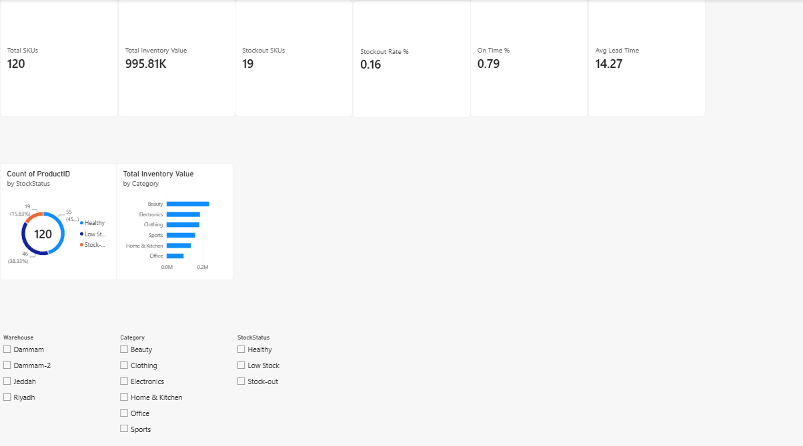
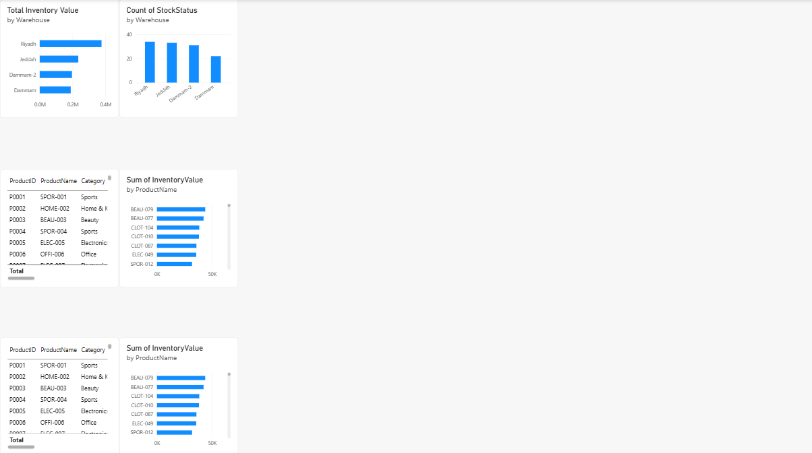
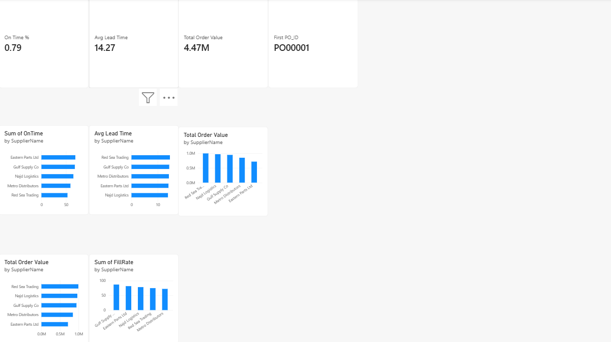
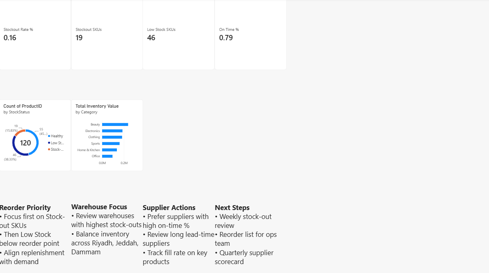

### SQL Analysis
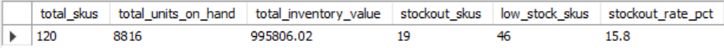
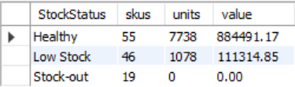
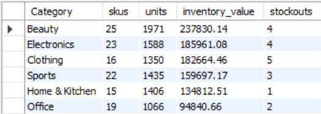
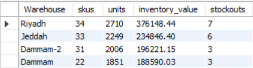
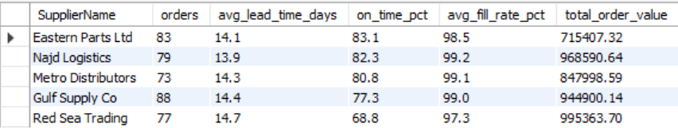
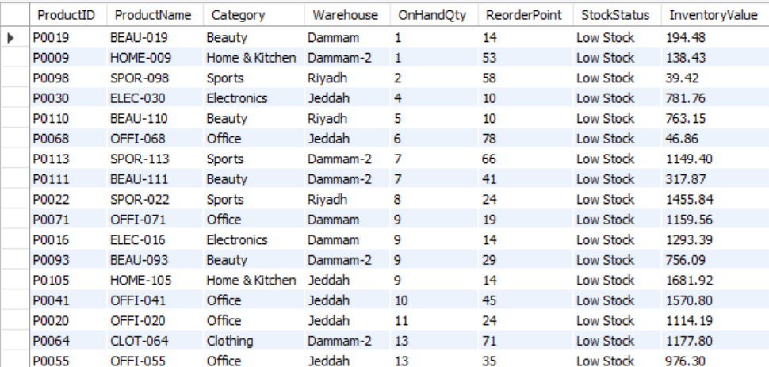

### Python Visualizations
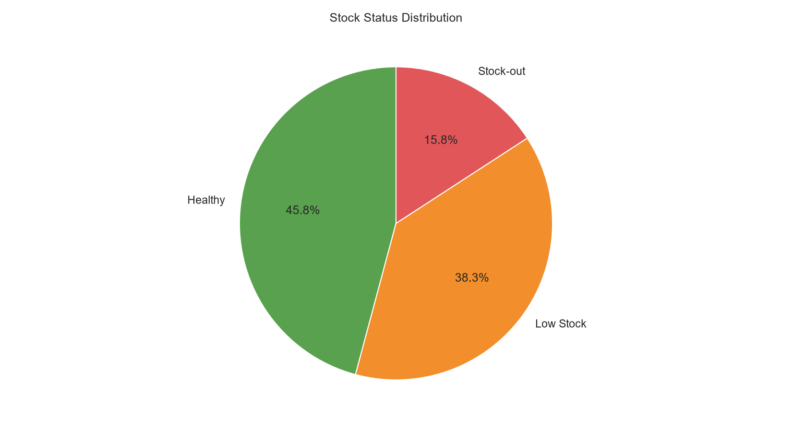
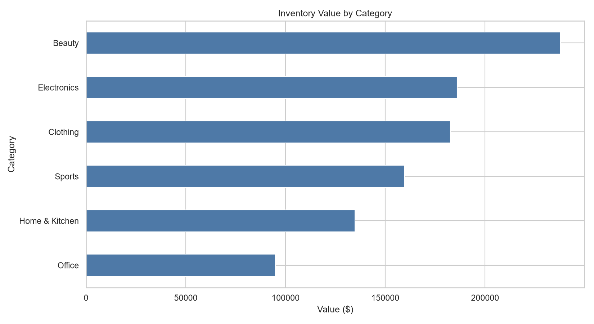
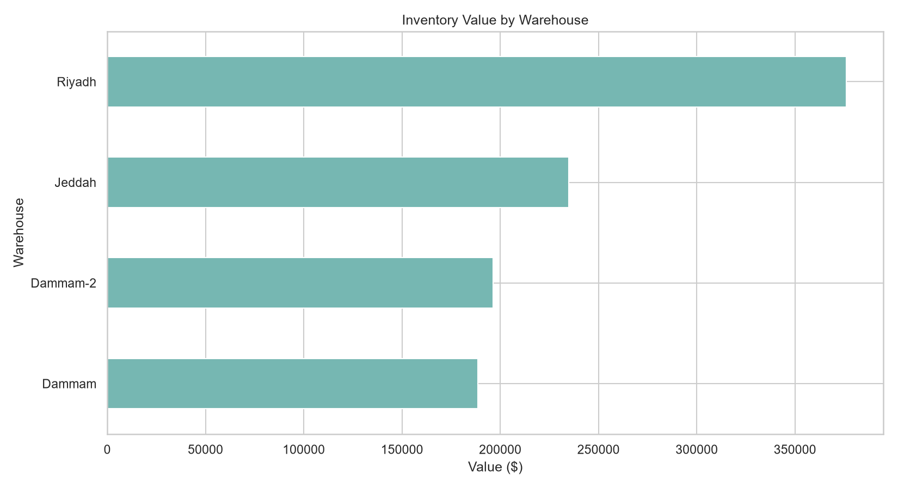
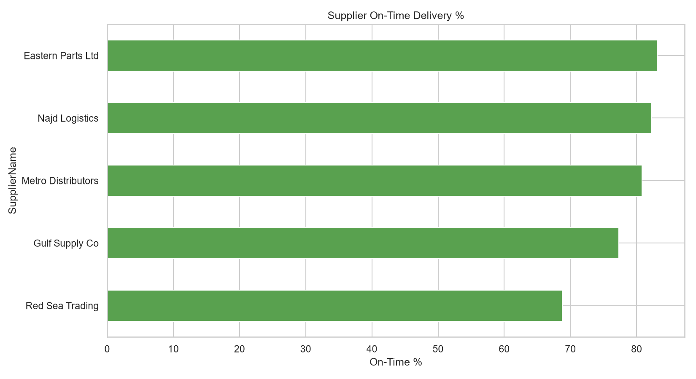
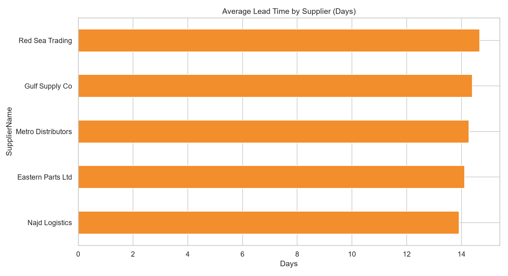
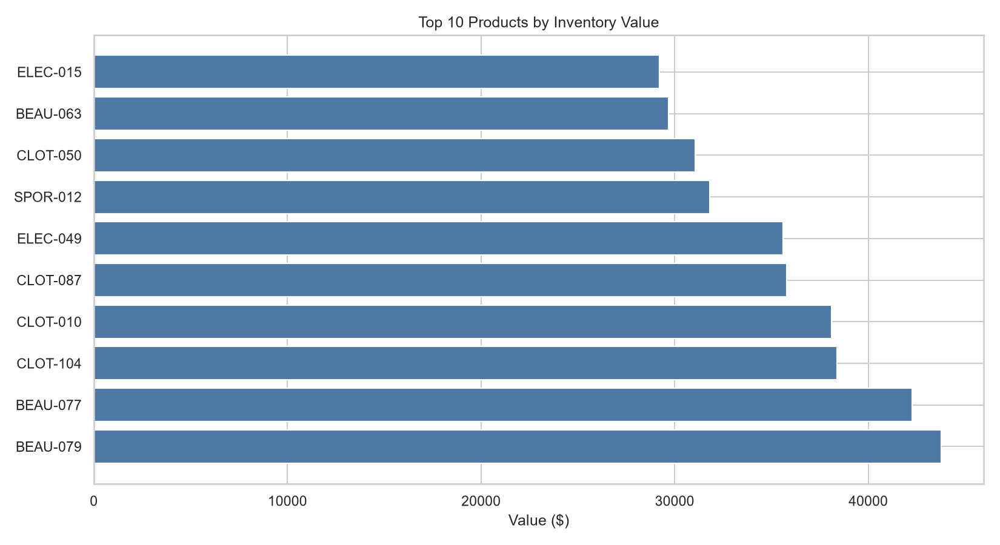

---

## 👤 Author

**Mubeen Salman**  
Aspiring Data Analyst  

- LinkedIn: [https://www.linkedin.com/in/mubeen-salman-459776364/]  
- GitHub: [https://github.com/MuhammadMubeen04]  

---

## 📄 License

This project is for educational and portfolio purposes.
